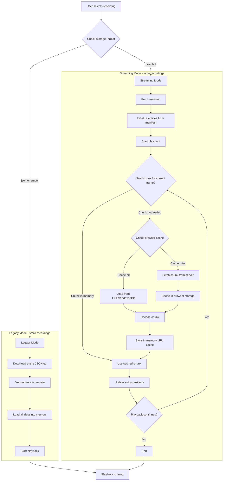
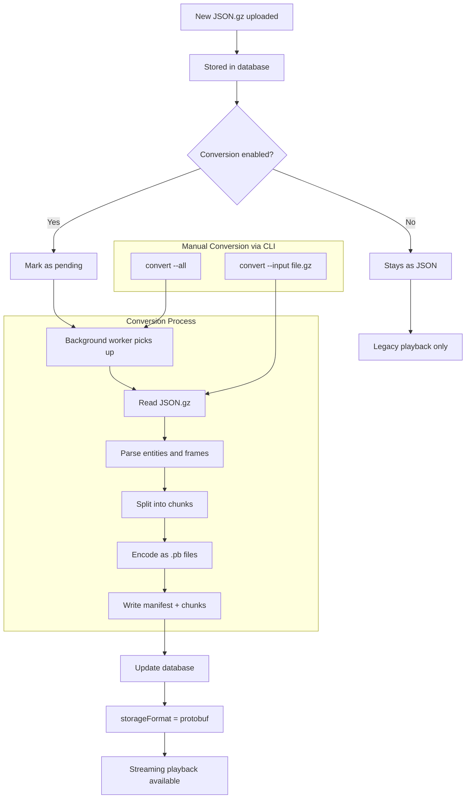

# Streaming Architecture

This document describes the playback and conversion flows for large recording support.

## Playback Flow

## Conversion Flow

## Browser Caching

The browser uses a two-tier caching system:

1. **Memory Cache (LRU)**: Up to 3 chunks kept in RAM for instant access
2. **Persistent Cache (OPFS/IndexedDB)**: Chunks saved to browser storage for future sessions

This allows:
- Smooth playback without re-downloading chunks
- Seeking to previously viewed sections instantly
- Reduced server load on repeat viewings
